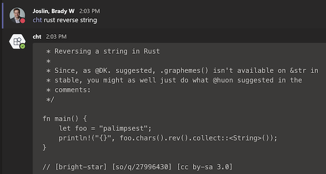

# Cheet Sheet MS Teams Bot

An MS Teams bot for getting code snippets from [Igor Chubin's](https://github.com/chubin) console-oriented cheat sheet service [cht.sh](https://cht.sh). @mention the `cht` bot in a post or comment in MS Teams following the pattern `@cht {language} {query}`.



`cht` is implemented as a [MS Teams outgoing webhook bot](https://docs.microsoft.com/en-us/microsoftteams/platform/webhooks-and-connectors/how-to/add-outgoing-webhook) that runs as a [Cloudflare Worker](https://workers.dev) that calls [cheat.sh](https://cheat.sh).

Built from the [MS Teams Outgoing Webhook Bot Workers Template](https://github.com/bradyjoslin/msteams-webhook-worker-template).

## Implementation Details

When a configured outgoing webhook bot is @mentioned in MS Teams a POST request is sent to the worker. The worker verifies the webhook message signature using an HMAC token provided by MS Teams when [creating the outgoing webhook](https://docs.microsoft.com/en-us/microsoftteams/platform/webhooks-and-connectors/how-to/add-outgoing-webhook#create-an-outgoing-webhook).

The worker extracts the message text and sends that as the query to cht.sh - `https://cht.sh/${message}?qT&style=bw`.

The worker replies with a JSON response that gets rendered as a threaded reply to the conversation in MS Teams:

```json
{
  "type": "message",
  "text": "* Reversing a string in Rust..."
}
```

## Initial Setup

For the basics of getting started with Cloudflare Workers and Wrangler, refer to the [getting started guide](https://developers.cloudflare.com/workers/quickstart).

1. Create an outgoing webhook in MS Teams [(docs)](https://docs.microsoft.com/en-us/microsoftteams/platform/webhooks-and-connectors/how-to/add-outgoing-webhook#create-an-outgoing-webhook), providing the URL for your worker.

1. Add a [worker secret variable](https://developers.cloudflare.com/workers/tooling/wrangler/secrets/) named `SECRET` equal to the HMAC security token provided by MS Teams when creating the ougoing webhook. This can be configured using Wrangler:

   ```bash
   wrangler secret put SECRET
   ```

1. Publish the wWrker with Wrangler:

   ```bash
   wrangler publish
   ```

**TODO** Deployment is automated through the [Wrangler GitHub Action](https://github.com/cloudflare/wrangler-action).

🎉
